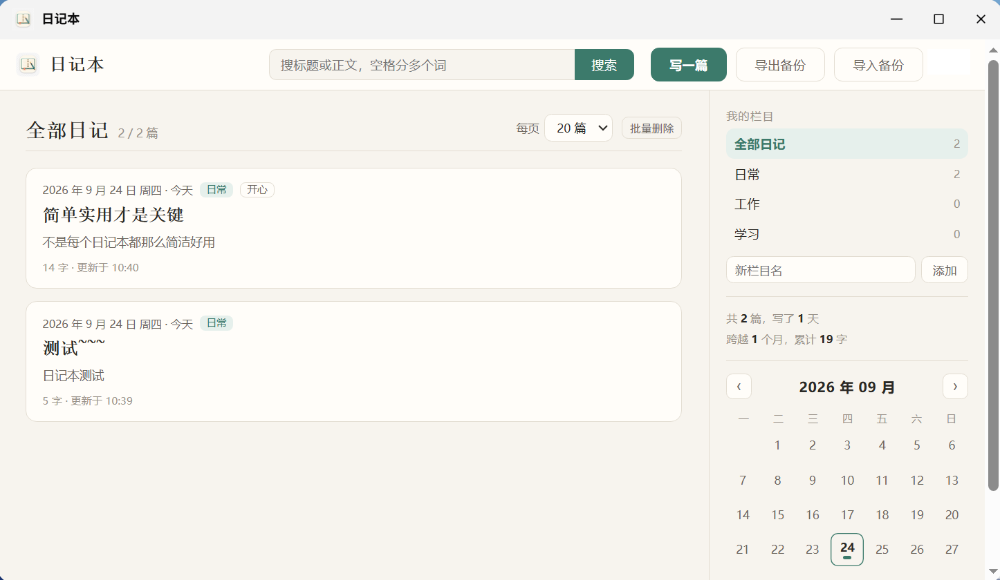
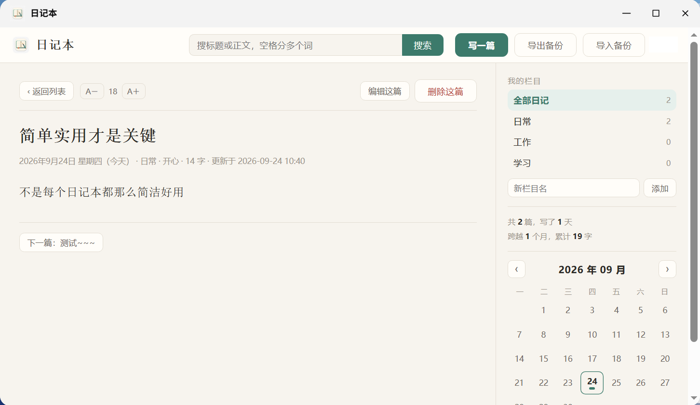

# 飞牛日记本 (fnOS Diary)

飞牛 fnOS 桌面原生第三方应用：多账号各看各的私人日记，仿博客排版，纯 Node 零依赖、不联网，日记只存在你自己的 NAS 上。

> 下载：**[Releases 里的 diary.fpk](https://github.com/xiaoliangzi024/fnos-diary/releases/download/v0.3.0/diary.fpk)**，完整安装说明见 [安装说明.txt](安装说明.txt)。





## 为什么做这个

NAS 上想记点东西，要么开浏览器标签页用网页版，要么一个编辑器糊在一篇里。
这个按飞牛桌面原生应用来做：桌面上点图标直接开，界面像博客——列表、点进去看文章、写完一篇接着写下一篇。
家里几个人共用一台机器，所以最在意的两件事是**多人之间互相看不到**、**更新和卸载都不能把数据弄丢**。

## 能做什么

- **多账号隔离**：身份取统一网关注入的 `X-Trim-Userid`，不靠界面隐藏，客户端伪造不了；每个账号只看自己的日记。
- **仿博客三层结构**：首页文章流 → 点卡片进文章页 → 编辑页。一天、一个栏目可以写多篇。
- **手动保存**：只有点「保存并返回」「保存，再写一篇」或按 Ctrl+S 才写盘，**没有自动保存**。切走时有未保存内容会弹框确认。
- **栏目**：自己加删，最多 30 个。删栏目不会丢日记——还有其他栏目就自动并入，最后一个删掉则退回「全部日记」（未分类）。
- **搜索**：标题 + 正文全文，多词空格分隔（AND，最多 8 个词），结果可翻页。中文是子串匹配。
- **删除**：单篇删除、列表批量勾选删除，所有删除都先列出标题和篇数让你确认。没有回收站。
- **显示**：字号 16–30 共 8 档可调；每页显示 10 / 20 / 30 / 50 篇可选（这两项存在设备上）。正文里的网址可直接点开。
- **备份**：一键导出 / 导入 JSON。导入上限 200MB，存十几年的量也能一次导回来；导入前自动留快照。
- **手机 / 平板**：浏览器访问 `你的飞牛地址/app/diary/`，窄屏自动单栏。

## 环境要求

- 飞牛 fnOS **1.1.3100 及以上**
- 应用中心安装 **Node.js v22**（装一次即可）
- 应用本身零依赖：服务端只用 Node 标准库，不联网、不上传任何数据

## 安装

1. 从 Releases 下载 `diary.fpk`。
2. 应用中心 → 手动安装 → 选中 `diary.fpk` → 下一步。全程不会问你问题，也不用勾选授权目录。
3. 回到桌面点「日记本」图标。界面左下角会显示当前版本号和日记实际存放路径。

## 数据放在哪

```
/var/apps/diary/home/diary/<账号目录>/entries/<篇id>.json   每篇一个文件
/var/apps/diary/home/diary/<账号目录>/categories.json       栏目
/var/apps/diary/home/diary/backups/                         导入前的快照
```

明文 JSON，方便你用记事本直接看和改，也方便自己额外备份。
代价要说清楚：**有 root 权限的人能直接打开看**，它防的是共用机器的其他人，**不防管理员**。
要防管理员得再加"每用户口令加密"（忘密码就彻底读不回来），目前没做。

## 更新与卸载

- **更新不丢数据**：升级脚本先把整个数据目录 `tar` 成备份并校验，校验不过就直接中止升级，保留最近 5 份。
- **卸载删干净**：卸载向导里必须勾选确认才继续，会把应用目录和数据目录一并删掉，不留残留。
- 别只依赖软件内的备份，重要内容定期「导出备份」到自己电脑上。

## 性能

列表和搜索走每个账号的内存索引（写入时同步更新，按目录签名判失效），不逐篇读全文。
1 万篇实测：列表首屏 1.16 秒 → 0.03 秒，搜索 0.04 秒，导入 4.2MB / 11001 篇正常完成。

## 还没做的

插图片 / 附件、导出 PDF、日历拖拽、回收站、跨设备记住字号和每页数量、防管理员加密。
需要哪个可以开 Issue 说，呼声大的优先做。

## 开发 / 自己打包

仓库结构：

```
diary/
  manifest                 应用名、版本、更新说明
  ICON.PNG  ICON_256.PNG   应用图标
  LICENSE                  授权声明
  cmd/                     9 个生命周期脚本（install/upgrade/uninstall 的 init 与 callback、main、config）
  config/privilege         权限与运行身份
  config/resource          资源占用声明
  app/server/server.js     后端（纯 Node 标准库，零依赖）
  app/www/                 前端（index.html / app.js / style.css，无框架）
  app/ui/config            应用中心里的展示配置
  wizard/uninstall         卸载前向导
tools/
  check_fpk.py             校验 .fpk 结构（文件是否齐、权限是否正确）
  fix_fpk_perms.py         给 .fpk 里的 cmd/ 脚本补可执行位
  fnpack.exe               飞牛官方打包工具，体积 3.9MB，不入库，需自行获取
打包fpk.bat                 双击：调 fnpack 打包 → 修权限 → 校验
本地预览.bat                双击：本机起服务和界面，改前端不用装到 NAS 上
```

改完代码双击 `打包fpk.bat` 即可产出 `diary.fpk`。两个坑提前说明：

1. `fnpack.exe` 不在这个仓库里（第三方二进制）。它是打包必需的，你得自己放一份到 `tools/` 下。
2. Windows 上打包会丢掉 `cmd/` 脚本的可执行位，所以打包流程里必须跑 `fix_fpk_perms.py`，`打包fpk.bat` 已经串好了这一步。
3. 两个 `.bat` 是 **GBK 编码**（cmd.exe 里显示中文不乱的唯一稳妥办法），在 GitHub 网页上点开会是乱码，下载下来用记事本打开正常。

## 反馈

有问题优先开 Issue，并且**把应用中心安装进度那一行的报错原文贴上来**——只说"装不上"没法判断。
日志在 `/var/apps/diary/var/app.log`。

## 授权

见 [LICENSE](LICENSE)：自用、学习、修改都可以，不要打包拿去卖。本项目按"能用就行"的自制软件标准分享，不提供任何保证，数据请自己备份。
