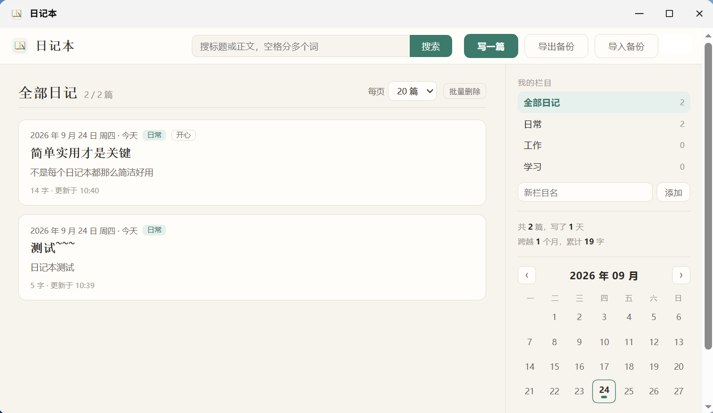
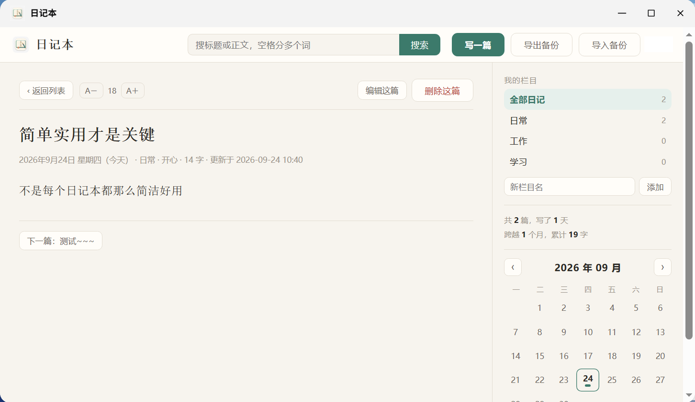

# 飞牛日记本 (fnOS Diary)

飞牛 fnOS 桌面原生第三方应用：多账号各看各的私人日记，仿博客排版，纯 Node 零依赖、不联网，日记只存在你自己的 NAS 上。

> 下载：
> - **NAS 上装的那个应用**：[diary.fpk（当前 0.4.1）](https://github.com/xiaoliangzi024/fnos-diary/releases/download/v0.4.1/diary.fpk)，完整安装说明见 [安装说明.txt](安装说明.txt)。
> - **电脑上离线写、自动同步回 NAS**：[日记本 Windows 客户端 0.1.0](https://github.com/xiaoliangzi024/fnos-diary/releases/download/client-v0.1.0/diary-win64-0.1.0.zip)，免安装 zip，见下面 [Windows 电脑客户端](#windows-电脑客户端离线写联网同步回-nas)。
> - 各版本更新说明和历史包都在 [Releases](https://github.com/xiaoliangzi024/fnos-diary/releases)。





## 为什么做这个

NAS 上想记点东西，要么开浏览器标签页用网页版，要么一个编辑器糊在一篇里。
这个按飞牛桌面原生应用来做：桌面上点图标直接开，界面像博客——列表、点进去看文章、写完一篇接着写下一篇。
家里几个人共用一台机器，所以最在意的两件事是**多人之间互相看不到**、**更新和卸载都不能把数据弄丢**。

## 能做什么

- **多账号隔离**：身份取统一网关注入的 `X-Trim-Userid`，不靠界面隐藏，客户端伪造不了；每个账号只看自己的日记。
- **仿博客三层结构**：首页文章流 → 点卡片进文章页 → 编辑页。一天、一个栏目可以写多篇。
- **手动保存**：只有点「保存并返回」「保存，再写一篇」或按 Ctrl+S 才写盘，**没有自动保存**。切走时有未保存内容会弹框确认。
- **栏目**：自己加删，最多 30 个。删栏目不会丢日记——还有其他栏目就自动并入，最后一个删掉则退回「全部日记」（未分类）。
- **搜索**：标题 + 正文全文，多词空格分隔（AND，最多 8 个词），结果可翻页。中文是子串匹配。
- **删除**：单篇删除、列表批量勾选删除，所有删除都先列出标题和篇数让你确认。没有回收站。
- **显示**：字号 16–30 共 8 档可调；每页显示 10 / 20 / 30 / 50 篇可选；顶栏「外观」可切浅色 / 护眼绿 / 深色 / 跟随系统，另有 6 个强调色，弹窗里带实时预览（这三项都存在设备上，不跟账号走）。三档配色都按护眼调过，正文和小字对比度都在 4.5:1 以上。正文里的网址可直接点开。
- **备份**：一键导出 / 导入 JSON。导入上限 200MB，存十几年的量也能一次导回来；导入前自动留快照。
- **手机 / 平板**：浏览器访问 `你的飞牛地址/app/diary/`，窄屏自动单栏。

## 环境要求

- 飞牛 fnOS **1.1.3100 及以上**
- 应用中心安装 **Node.js v22**（装一次即可）
- 应用本身零依赖：服务端只用 Node 标准库，不联网、不上传任何数据

## 安装

1. 从 Releases 下载 `diary.fpk`。
2. 应用中心 → 手动安装 → 选中 `diary.fpk` → 下一步。全程不会问你问题，也不用勾选授权目录。
3. 回到桌面点「日记本」图标。界面左下角会显示当前版本号和日记实际存放路径。

## Windows 电脑客户端（离线写，联网同步回 NAS）

不想开浏览器也能记同一本日记：电脑上离线写，联网后自动同步回 NAS，界面和 NAS 上那份是同一套。

下载：**[diary-win64-0.1.0.zip](https://github.com/xiaoliangzi024/fnos-diary/releases/download/client-v0.1.0/diary-win64-0.1.0.zip)**（110 MB，只要 Windows x64；文件名用英文是因为 GitHub 会丢掉附件名里的中文，解压出来的文件夹和程序还是中文的）

1. 下载后**先解压**，别在压缩包里直接双击运行。
2. 双击 `日记本\日记本.exe`。第一次打开 Windows 可能弹蓝色提示（程序没有代码签名）：点「更多信息」→「仍要运行」。
3. 点顶栏「设置」→ 粘贴你飞牛的地址（公网 FN Connect 地址、局域网地址都认，带不带 `/app/diary` 都行）→ 添加 → 登录 NAS。
4. 之后照常写。顶栏「同步」按钮显示当前状态：`要登录` / `待传 N` / `同步`；点一下立刻传。

- **前提**：NAS 端的日记本要在 **0.4.1 或以上**，同步接口从这一版开始才有。
- **双向同步**：新增、修改、删除都同步；两边都改过同一篇时按"改得晚的赢"处理。栏目也跟着同步，换 NAS、换账号会自动重映射，不会错栏。
- **自动同步间隔自己选**：关闭 / 1 / 5 / 15 / 30 分钟 / 1 小时，默认 5 分钟。选「关闭」也还能随时手动点「同步」，关程序前照例会补传一次。
- **多台 NAS、多个账号**：每条地址各自登录，本机按账号各存一份日记，互不覆盖。
- **不存你的 NAS 口令**：只保存登录后的浏览器 cookie，每条地址还能单独关掉「保持登录」。
- **数据在哪**：就在那个文件夹的 `日记本数据` 里，明文 JSON，记事本就能打开；主题、字号、每页条数这些偏好只留本机，不跟着同步。
- **卸载**：整个文件夹删掉即可，不留残留。删之前先看顶栏「同步」是不是干净的（不写待传），确认日记都已经传上 NAS 了。
- 明文存储**不防管理员**：同一台电脑上能进这个目录的人就看得到内容，和 NAS 端一个标准。

## 数据放在哪

```
/var/apps/diary/home/diary/<账号目录>/entries/<篇id>.json   每篇一个文件
/var/apps/diary/home/diary/<账号目录>/categories.json       栏目
/var/apps/diary/home/diary/backups/                         导入前的快照
```

明文 JSON，方便你用记事本直接看和改，也方便自己额外备份。
代价要说清楚：**有 root 权限的人能直接打开看**，它防的是共用机器的其他人，**不防管理员**。
要防管理员得再加"每用户口令加密"（忘密码就彻底读不回来），目前没做。

## 更新与卸载

- **更新不丢数据**：升级脚本先把整个数据目录 `tar` 成备份并校验，校验不过就直接中止升级，保留最近 5 份。
- **卸载删干净**：卸载向导里必须勾选确认才继续，会把应用目录和数据目录一并删掉，不留残留。
- 别只依赖软件内的备份，重要内容定期「导出备份」到自己电脑上。

## 性能

列表和搜索走每个账号的内存索引（写入时同步更新，按目录签名判失效），不逐篇读全文。
1 万篇实测：列表首屏 1.16 秒 → 0.03 秒，搜索 0.04 秒，导入 4.2MB / 11001 篇正常完成。

## 还没做的

插图片 / 附件、导出 PDF、日历拖拽、回收站、跨设备记住外观和字号、防管理员加密。
需要哪个可以开 Issue 说，呼声大的优先做。

## 开发 / 自己打包

仓库结构：

```
diary/
  manifest                 应用名、版本、更新说明
  ICON.PNG  ICON_256.PNG   应用图标
  LICENSE                  授权声明
  cmd/                     9 个生命周期脚本（install/upgrade/uninstall 的 init 与 callback、main、config）
  config/privilege         权限与运行身份
  config/resource          资源占用声明
  app/server/server.js     后端（纯 Node 标准库，零依赖）
  app/www/                 前端（index.html / app.js / style.css / theme.js，无框架）
  app/ui/config            应用中心里的展示配置
  wizard/uninstall         卸载前向导
tools/
  check_fpk.py             校验 .fpk 结构（文件是否齐、权限是否正确）
  fix_fpk_perms.py         给 .fpk 里的 cmd/ 脚本补可执行位
  fnpack.exe               飞牛官方打包工具，体积 3.9MB，不入库，需自行获取
client/                    Windows 桌面客户端（Electron，只用 Node 标准库 + Electron 自带运行时）
  src/                     主进程：本地服务、同步引擎、登录窗、原生菜单
  ui/                      设置面板（日记界面本身复用 diary/app/www，打包时原样拷进去）
  build/portable.js        拼免安装包（改名 Electron 运行时 + 拷代码），产物在 client/dist/日记本/
  test/                    端到端测试：起两台模拟 NAS 驱动真实界面，97 项断言
打包fpk.bat                 双击：调 fnpack 打包 → 修权限 → 校验
本地预览.bat                双击：本机起服务和界面，改前端不用装到 NAS 上
```

改完代码双击 `打包fpk.bat` 即可产出 `diary.fpk`。两个坑提前说明：

1. `fnpack.exe` 不在这个仓库里（第三方二进制）。它是打包必需的，你得自己放一份到 `tools/` 下。
2. Windows 上打包会丢掉 `cmd/` 脚本的可执行位，所以打包流程里必须跑 `fix_fpk_perms.py`，`打包fpk.bat` 已经串好了这一步。
3. 两个 `.bat` 是 **GBK 编码**（cmd.exe 里显示中文不乱的唯一稳妥办法），在 GitHub 网页上点开会是乱码，下载下来用记事本打开正常。

客户端自己编译：在 `client/` 下 `npm install`（只装 Electron），然后 `npm run build` 产出免安装包目录 `client/dist/日记本/`，`npm run test:packed` 会先打包再跑一遍全部端到端断言。要把客户端更新到 GitHub，得把那个目录压成 zip 当 Release 附件传——单文件超过 100 MB 就传不进仓库，所以二进制不进 git。

## 反馈

有问题优先开 Issue，并且**把应用中心安装进度那一行的报错原文贴上来**——只说"装不上"没法判断。
日志在 `/var/apps/diary/var/app.log`。

## 授权

见 [LICENSE](LICENSE)：自用、学习、修改都可以，不要打包拿去卖。本项目按"能用就行"的自制软件标准分享，不提供任何保证，数据请自己备份。
